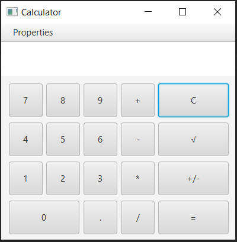
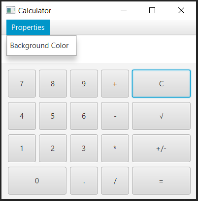
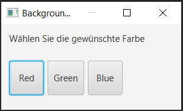
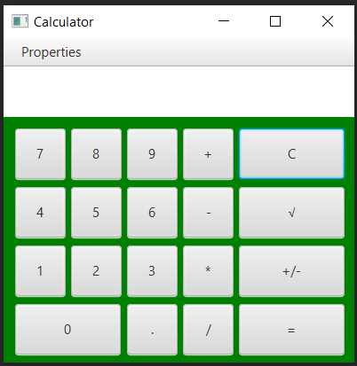

In dieser Prüfungsaufgabe gilt es einen funktionsfähigen Taschenrechner in JavaFX zu implementieren.

## Aufgabe:
- Implementiert einen Taschenrechner, der so aussieht wie auf den Bildern unten.
- Die Grundrechenoperationen +, -, * und / müssen funktionieren.
- Die Taste "=" zeigt das Resultat und die Taste "C" leert alle Felder (Clear).
- Der Taschenrechner soll mit zwei Zahlen rechnen können, d.h. "Zahl1 <Operation> Zahl2 = Resultat"
- Die Eingabe muss über Buttons UND über Tasten auf der Tastatur möglich sein.
- Setzt für die Implementation FXML und Controller ein.
- Testet die Funktionen mit positiven und negativen Tests und erstellt ein kurzes Testprotokoll.
- Es sollen möglichst keine unbehandelten Exceptions geworfen werden.
- Ich erwarte von jedem einzelnen Lernenden eine Abgabe. Nichtabgabe hat die Note 1 zur Folge.
- Die Lösung muss von jedem einzelnen selbständig erarbeitet werden (eigener Code, kein Copy & Paste).

## Abgrenzung:
- Die Implementierung der Funktion "Wurzel" ist optional.
- Die Implementierung der Funktion "+/-" für die Vorzeichenumkehrung ist optional.
- Die Verkettung von mehreren Zahlen, z.B. "Zahl1 <Operation> Zahl2 <Operation> Zahl3 .... = Resultat" ist optional.

Taschenrechner Main Fenster:  

Menupunkt "Properties" mit Eintrag "Background Color":  

Subwindow "Background Color":  

Hauptfenster nach dem Einstellen der Hintergrundfarbe "Green":  

## Abgabe:
ZIP File vom ganzen IntelliJ Project (so dass ich es importieren und laufen lassen kann)
Kurzes Testprotokoll als PDF oder Word
Abgabe bis Donnerstag, 18. März 2021 um 22:00 Uhr

## Tipps:
- Nutzt die Doku! JavaFX API Dokumentation und FXML Referenz (siehe Links auf dem BSCW).
- Tutorials sind hier zu finden:
  - https://docs.oracle.com/javase/8/javase-clienttechnologies.htm
  - https://o7planning.org/11009/javafx
- Das Wurzelzeichen kann mit dem String "u221a" abgebildet werden. Einfach den Text des Buttons auf "u221a" setzen.
- Ein neues Subwindow kann man mit "Stage subWindow = new Stage()" erstellen. Die Modalität kann mit setModality(...) gesetzt werden mit show() wird das Subwindow angezeigt. Vergesst nicht, dieser neuen Stage eine Scene und ein Layout zu setzen.
- Für das Menu sind die Klassen MenuBar, Menu und MenuItem zu verwenden.